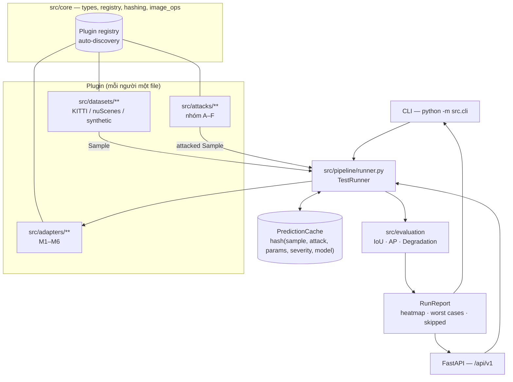
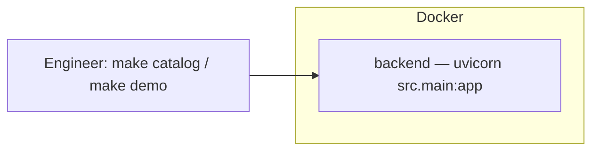

# Architecture — AdverTest

## System Overview

AdverTest sinh biến thể tấn công/nhiễu từ một dataset đã ẩn danh, chạy qua model
perception đang phát triển, và đo mức suy giảm hiệu năng so với ảnh sạch. Toàn hệ
thống là **simulation only**: không có API nào đẩy model sang môi trường triển
khai, và mọi kết luận "model đủ bền" đều do con người ký (plan §7).

Kiến trúc chia theo bốn loại **plugin** (attack, model adapter, dataset, metric) và
một lõi mỏng điều phối chúng. Mục tiêu thiết kế số một của bản starter này: nhiều
người thêm attack song song mà không sửa cùng một file.

## Architecture Diagram

## Components

### 1. `src/core` — lõi không phụ thuộc framework
- **Purpose:** kiểu dữ liệu miền (`Sample`, `Box`, `Prediction`, `ModelInfo`),
  registry plugin, hàm băm cache, tiện ích ảnh numpy.
- **Key contract:** ảnh luôn là `np.ndarray` float32, shape `(H, W, 3)`, giá trị
  `[0, 1]`; `validate_image` là nơi duy nhất định nghĩa điều đó.
- **Registry:** `Registry.register` làm decorator, `discover(package)` import mọi
  module public trong package → **không có danh sách plugin tập trung**.

### 2. `src/attacks` — nhóm A–F (plan §2)
- **Purpose:** mỗi corruption/attack là một subclass `BaseAttack` trong file riêng.
- **`BaseAttack.run`** (không override) ép các bất biến: severity 0 = no-op,
  kiểm tra khoảng severity, đảm bảo có model cho attack white-box, clip `[0,1]`,
  validate shape/dtype/NaN.
- **`apply`** là hàm thuần: `(sample, severity, ctx.rng) -> Sample`.
- **Đã có:** `gaussian_noise` (A), `fgsm` (D) làm mẫu; các nhóm khác là slot.

### 3. `src/adapters` — model under test (M1–M6, plan §1.2)
- **Contract:** `predict`, `metadata`, `postprocess`, `loss_for_attack`,
  `input_gradient`.
- **Gradient bridge:** adapter giữ framework (torch/ONNX), trả gradient dạng
  numpy → attack nhóm D không import torch, CI chạy không GPU.
- **Đã có:** `blob_detector` (threshold + connected components, không cần weight)
  làm model tham chiếu cho test và demo.

### 4. `src/datasets` — nguồn dữ liệu + cổng ẩn danh (plan §6)
- `DatasetSource.require_anonymized()` được `TestRunner` gọi **trước** mọi
  inference; dataset chưa ẩn danh ⇒ `AnonymizationRequiredError` (HTTP 409).
- **Đã có:** `synthetic_shapes` (sinh ngẫu nhiên có seed, kèm depth prior).

### 5. `src/evaluation` — chỉ số
- **Đã có:** IoU, matching theo score, AP một ngưỡng IoU (AP50) macro theo class,
  `RunReport` với `D(c,s)`, heatmap, worst cases.
- **Slot:** AP@[.50:.95] (pycocotools), mPC/rPC/RR/mCE, `RA(s)`, ASR
  object/image/targeted, mIoU & 3D metrics, bootstrap CI, RobustScore.

### 6. `src/pipeline` — điều phối & chi phí
- `TestRunner.estimate` cho ước tính **trước** khi chạy (plan §5 bắt buộc).
- `TestRunner.run`: dataset → cổng ẩn danh → clean prediction (cache) → từng cell
  `(attack, severity)` → AP → `RunReport`.
- Ngẫu nhiên tái lập: rng dẫn xuất từ `hash(seed, sample, attack, severity)`.
- **Slot:** quét hai tầng, dừng sớm theo CI, batch tuning, Optuna red-team, Celery.

### 7. `src/api` — HTTP
- `GET /catalog/{attacks,models,datasets}` — catalog kèm `owner` và
  `params_schema` (UI tự sinh form từ đây).
- `POST /runs/estimate`, `POST /runs`, `GET /runs`, `GET /runs/{id}`.
- Mọi response có header `X-Simulation-Only: true`.
- **Slot:** RBAC Engineer/Reviewer, review queue + audit log, WebSocket tiến độ.

## Data Flow (một Test Run)

1. Client gửi `RunConfig` (model, dataset, attacks, severities, limit, seed).
2. `POST /runs/estimate` trả số cell, số forward pass, thời gian dự kiến.
3. `TestRunner` nạp dataset → **cổng ẩn danh** → nạp adapter.
4. Clean prediction: lấy từ cache theo `hash(sample, model_version)`.
5. Mỗi `(attack, severity)`: sinh biến thể (rng có seed) → predict (cache theo
   `hash(sample, attack, params, severity, model_version)`) → AP.
6. `RunReport`: `AP_clean`, `AP(c,s)`, `D(c,s)`, heatmap, worst cases, `skipped`.
7. `worst_degradation ≥ review_degradation_threshold` ⇒ `needs_review = true` →
   con người quyết định (chưa có queue, xem slot ở §7 phần Components).

## Extension Model

| Thêm gì | Tạo file | Đăng ký |
|---|---|---|
| Attack | `src/attacks/<nhóm>/<name>.py` | `@ATTACKS.register` |
| Model | `src/adapters/<name>.py` | `@MODELS.register` |
| Dataset | `src/datasets/<name>.py` | `@DATASETS.register` |
| Metric | hàm mới trong `src/evaluation/` | gọi từ `RunReport` |

Chi tiết: [docs/CONTRIBUTING_ATTACKS.md](docs/CONTRIBUTING_ATTACKS.md).

## Design Decisions

| Decision | Choice | Reason |
|---|---|---|
| Cách mở rộng | Registry + auto-discovery theo package | Không có file chung để sửa ⇒ không tranh chấp; trùng tên báo lỗi ngay |
| Chuẩn ảnh | float32 `[0,1]`, `(H,W,3)` | Một quy ước duy nhất, `BaseAttack.run` ép được, tránh lẫn uint8/float |
| Gradient | Adapter trả numpy qua `input_gradient` | Attack không phụ thuộc framework; CI không cần torch/GPU |
| Model tham chiếu | `blob_detector` thuần numpy | Test toàn hệ thống không cần weight/GPU/mạng |
| Severity | `0` = no-op, `1..5` | Sanity check #1 của plan §3 thành thuộc tính của kiến trúc |
| Tham số attack | Pydantic model `extra="forbid"`, frozen | Typo thành lỗi ngay; params vào cache key; UI sinh form từ JSON schema |
| Cache | Content-addressed `(sample, attack, params, model_version)` | Bỏ forward pass trùng (plan §5); `version` đổi khi weight/threshold đổi |
| Ngẫu nhiên | `ctx.rng` dẫn xuất từ seed run | Run tái lập được, chạy song song vẫn cho cùng số |
| Lưu trữ | In-memory dict | Đủ cho starter; đổi sang PostgreSQL không cần đổi contract route |

## Security & Privacy

- Ẩn danh là **cổng cứng** trước inference, không có cờ bypass (plan §6).
- API key chỉ nằm trong `.env` (không commit).
- Input validate bằng Pydantic; `extra="forbid"` ở mọi params model.
- Banner `SIMULATION ONLY` trong `/health` và header mọi response.

## Deployment Architecture

Hiện tại chỉ một container backend (Dockerfile multi-stage sẵn có). Khi thêm
worker GPU: tách `runner` sang Celery worker + Redis, PostgreSQL cho run history,
MinIO cho dataset — sơ đồ đầy đủ ở `docs/advertest-plan.md` §4.
