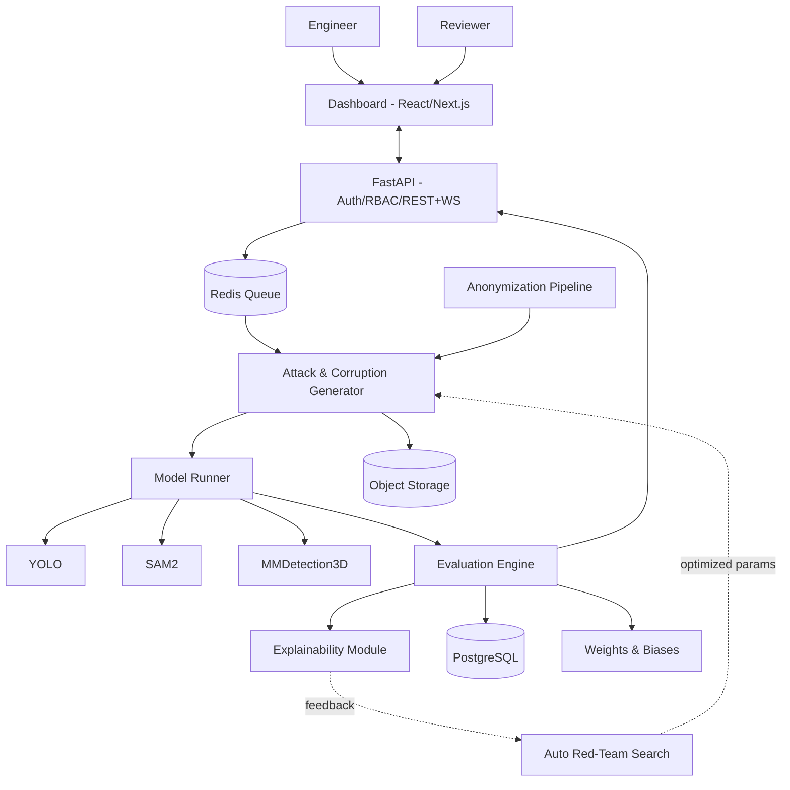

# 🛡️ AdverTest - Nền tảng Kiểm thử Độ bền vững cho Mô hình Perception

**Giả định làm việc:** Đề bài có định dạng như một thử thách kỹ thuật/hackathon. Tài liệu này được xây dựng để dùng được ngay cho hai mục đích: (a) làm đề xuất/thuyết trình dự án, và (b) làm bản đặc tả đủ chi tiết để bắt tay triển khai thật theo từng giai đoạn.

---

## 📋 Mục lục

1. Phân tích đề bài
2. Tầm nhìn sản phẩm
3. Kiến trúc hệ thống
4. Danh sách chức năng đầy đủ (Cơ bản → Nâng cao → Mở rộng)
5. Mô tả chi tiết giao diện (10 màn hình)
6. Chỉ số đo lường & KPI
7. Lộ trình phát triển
8. Rủi ro & giải pháp
9. Bảng đối chiếu với yêu cầu đề bài
10. Gợi ý kịch bản demo

---

## 1. 🔍 Phân tích đề bài

### 1.1 Bản chất vấn đề

Đề bài xoay quanh một khoảng trống rất thực tế trong quy trình phát triển AI cho perception (nhận diện, phát hiện vật thể, phân đoạn, 3D detection): mô hình thường được đánh giá kỹ trên tập test "sạch", nhưng gần như không được kiểm chứng có hệ thống trước các điều kiện bất lợi của thế giới thực — sương mù, mưa, nhiễu cảm biến, vật cản, hay tệ hơn là các tấn công adversarial được thiết kế có chủ đích. Đó là khoảng trống giữa "model hoạt động tốt trên benchmark" và "model đủ an toàn để triển khai" — với các hệ thống an toàn cao (xe tự hành, robot, giám sát), khoảng trống này có thể trả giá rất đắt.

Đây là quy trình kiểm thử có kiểm soát dành cho mô hình perception: thay vì chờ lỗi xuất hiện trong môi trường thực, đội kỹ sư chủ động tạo điều kiện bất lợi trong môi trường mô phỏng để xác định điểm yếu trước.

### 1.2 Phân rã 3 trụ cột của đề bài

| Trụ cột | Nội dung gốc | Ý nghĩa thiết kế |
|---|---|---|
| **Thực trạng** | Model bị đánh lừa bởi nhiễu, thời tiết, che khuất, patch adversarial; thiếu công cụ hệ thống | Cần một **nền tảng** có quy trình lặp lại, lưu vết được, mở rộng được — không phải script rời rạc |
| **Vấn đề** | Sinh phép biến đổi/tấn công, áp lên dữ liệu, đo suy giảm hiệu năng | Cốt lõi là 3 khối: **Generator (sinh biến thể) → Runner (chạy model) → Evaluator (đo lường)** |
| **Ràng buộc** | Human-in-the-loop, chỉ test simulation, đủ 3 nhóm chỉ số, tối ưu GPU, ẩn danh dữ liệu | Không phải "tính năng thêm" mà là **triết lý thiết kế xuyên suốt toàn hệ thống** |

### 1.3 Đối tượng người dùng (Personas)

| Vai trò | Mục tiêu chính | Tương tác chính |
|---|---|---|
| 👨‍💻 **Kỹ sư Perception** *(Engineer — bắt buộc)* | Tìm điểm yếu model nhanh nhất, nhiều nhất, với chi phí GPU hợp lý | Tạo Test Run, xem so sánh trước/sau, gắn cờ case bất thường |
| 🛡️ **Trưởng nhóm An toàn** *(Reviewer — bắt buộc)* | Ra quyết định cuối: model đã đủ tin cậy để bước sang giai đoạn validate thật chưa | Duyệt Robustness Report, xử lý hàng đợi review, ký xác nhận quyết định |
| ⚙️ **Quản trị MLOps** *(Admin — vai trò mở rộng)* | Kiểm soát chi phí hạ tầng, người dùng, model registry | Cấu hình ngân sách GPU, đăng ký model mới, đặt ngưỡng CI/CD Gate |

### 1.4 Từ ràng buộc đến giải pháp thiết kế

| Ràng buộc trong đề bài | đáp ứng như thế nào |
|---|---|
| Human-in-the-loop | Không bước nào tự động "quyết định triển khai" — mọi Robustness Score thấp đều bị đẩy vào **hàng đợi Review** bắt buộc con người xác nhận |
| Chỉ test simulation, chưa validate thì không triển khai thật | Banner **"SIMULATION ONLY"** cố định trên mọi màn hình; hệ thống không có bất kỳ kết nối kỹ thuật nào tới pipeline triển khai production |
| Đủ bộ chỉ số (mAP/IoU trước-sau, robustness accuracy theo mức độ, tỷ lệ tấn công thành công) | Evaluation Engine tính đồng thời cả 3 nhóm cho **mọi** Test Run, không phải tùy chọn |
| Tối ưu chi phí GPU khi chạy nhiều biến thể | Caching, dynamic batching, Active Sampling, và Auto Red-Team Search thay brute-force |
| Ẩn danh khuôn mặt/biển số | Bước **bắt buộc**, không thể bỏ qua, ngay tại cổng nạp dữ liệu — dữ liệu chưa ẩn danh không được đi tiếp |

---

## 2. 🎯 Mục tiêu hệ thống

### Tên hệ thống

**AdverTest** là nền tảng kiểm thử độ bền vững cho mô hình perception trong môi trường mô phỏng.

### Phạm vi kỹ thuật

AdverTest cung cấp pipeline để sinh biến thể tấn công/nhiễu, chạy đánh giá trên mô hình đang phát triển, tính các chỉ số robustness, và lưu toàn bộ bằng chứng phục vụ phân tích hoặc review. Mục tiêu là chuẩn hóa quy trình kiểm thử thay cho cách dùng script rời rạc và tổng hợp kết quả thủ công.

### Nguyên tắc thiết kế cốt lõi

1. **Bắt buộc human-in-the-loop và ẩn danh hóa** — không có đường đi bỏ qua review thủ công hoặc bước xử lý dữ liệu nhạy cảm
2. **Model-agnostic** — kiến trúc adapter cho phép tích hợp thêm model mới ngoài YOLO/SAM2/MMDetection3D mà không sửa phần lõi
3. **Cost-aware theo mặc định** — mọi Test Run đều có ước tính tài nguyên trước khi chạy
4. **Truy vết được** — mọi chỉ số suy giảm đều liên kết được với ảnh, biến thể tấn công, và lần chạy cụ thể
5. **Mở rộng theo giai đoạn** — cùng một kiến trúc dữ liệu hỗ trợ từ MVP đến các chiến lược tìm kiếm tự động phức tạp hơn

---

## 3. 🏗️ Kiến trúc hệ thống

### 3.1 Sơ đồ tổng thể

### 3.2 Vai trò từng thành phần

| Thành phần | Nhiệm vụ | Công nghệ đề xuất |
|---|---|---|
| Frontend Dashboard | Cấu hình test, trực quan hóa, review | React/Next.js, Recharts |
| API Gateway | Auth, RBAC, REST + WebSocket (tiến trình real-time) | FastAPI |
| Job Queue | Điều phối job theo ưu tiên & ngân sách GPU | Redis + Celery/RQ |
| Attack & Corruption Generator | Sinh biến thể: 15 loại corruption (chuẩn ImageNet-C) × 5 mức độ, adversarial (FGSM/PGD), patch, occlusion | torchattacks, imagecorruptions |
| Anonymization Pipeline | Phát hiện & làm mờ mặt/biển số trước khi dữ liệu vào hệ thống | RetinaFace/YOLO-face + LP detector |
| Model Runner | Batch inference, quản lý adapter cho từng model | PyTorch, ONNX Runtime |
| Evaluation Engine | Tính mAP, IoU, Robustness Score, Attack Success Rate | pycocotools, custom |
| Auto Red-Team Search | Tìm tổ hợp tấn công gây fail nhiều nhất với số lần chạy tối thiểu | Bayesian Optimization / thuật toán tiến hóa |
| Explainability Module | Grad-CAM, phân cụm lỗi theo pattern | pytorch-grad-cam, scikit-learn |
| Experiment Tracking | So sánh robustness giữa các phiên bản model | Weights & Biases |
| Data Store | Metadata Test Run, kết quả, audit log | PostgreSQL |
| Object Storage | Ảnh gốc, ảnh biến đổi, artifact | MinIO/S3-compatible |
| Hạ tầng | Container hóa, GPU scheduling | Docker + NVIDIA Container Toolkit |

### 3.3 Luồng xử lý một Test Run

1. Engineer chọn Dataset (đã qua Anonymization) + Model + cấu hình tấn công → xác nhận ước tính GPU
2. Job vào Queue, Generator sinh biến thể theo yêu cầu (hoặc theo gợi ý của Auto Red-Team nếu bật)
3. Model Runner chạy song song batch ảnh gốc & ảnh biến đổi
4. Evaluation Engine tính mAP/IoU/Robustness Score, đẩy log lên W&B
5. Nếu Robustness Score dưới ngưỡng cấu hình → tự động tạo case trong hàng đợi Review
6. Reviewer xử lý, ghi quyết định (audit trail), có thể yêu cầu chạy lại với biến thể cụ thể
7. Toàn bộ kết quả hiển thị tại Dashboard, xuất báo cáo khi cần

---

## 4. ⚙️ Danh sách chức năng đầy đủ

### 4.1 Nhóm CƠ BẢN (MVP)

| ID | Chức năng | Mô tả |
|---|---|---|
| F1 | Quản lý & Ẩn danh Dataset | Upload ảnh/video/point cloud, tự động phát hiện & làm mờ mặt/biển số, preview trước-sau ẩn danh |
| F2 | Thư viện Corruption | 15 loại theo chuẩn ImageNet-C (mưa, sương mù, tuyết, nhiễu cảm biến, motion blur, ánh sáng...), mỗi loại 5 mức độ |
| F3 | Thư viện Adversarial cơ bản | FGSM, PGD (digital), patch adversarial, occlusion ngẫu nhiên |
| F4 | Kết nối Model | Adapter sẵn cho YOLO (2D detection), SAM2 (segmentation), MMDetection3D (3D detection) |
| F5 | Chạy Test Run đơn giản | Áp 1+ phép biến đổi lên tập ảnh mẫu, chạy song song baseline vs. perturbed |
| F6 | So sánh Trước/Sau trực quan | Bounding box/mask overlay, slider so sánh, ≥2 vai trò xem được |
| F7 | Báo cáo mAP/IoU | Bảng & biểu đồ mAP/IoU trước-sau theo từng loại biến đổi |
| F8 | RBAC 2 vai trò | Engineer & Reviewer — phân quyền màn hình và hành động rõ ràng |
| F9 | Human-in-the-loop cơ bản | Gắn cờ case lỗi → Reviewer xem, ghi chú, quyết định |

### 4.2 Nhóm NÂNG CAO

| ID | Chức năng | Mô tả |
|---|---|---|
| F10 | Severity Sweep tự động | Quét toàn bộ tổ hợp loại tấn công × 5 mức độ mà không cần cấu hình từng cái |
| F11 | Robustness Matrix | Heatmap tự động: hàng = loại tấn công, cột = mức độ, màu = % suy giảm |
| F12 | Worst-Case Ranking | Tự động xếp hạng Top-N ảnh/biến thể gây suy giảm nặng nhất |
| F13 | Benchmark đa mô hình | So sánh nhiều phiên bản/kiến trúc model, đồng bộ lịch sử qua W&B |
| F14 | Tối ưu chi phí GPU | Cache kết quả trùng, dynamic batching, giới hạn ngân sách trước khi chạy |
| F15 | Chỉ số chi tiết theo mức độ | Robustness Accuracy & Attack Success Rate theo từng ngưỡng severity |
| F16 | Export báo cáo | Xuất PDF/Excel phục vụ lưu hồ sơ, trình bày |

### 4.3 Nhóm MỞ RỘNG

| ID | Chức năng | Giá trị kỹ thuật |
|---|---|---|
| F17 | **Auto Red-Team Search Agent** | Dùng Bayesian Optimization hoặc thuật toán tiến hóa để tìm nhanh tổ hợp tham số gây suy giảm mAP/IoU lớn nhất, thay cho brute-force toàn bộ không gian tìm kiếm |
| F18 | **Robustness Score** | Chuẩn hóa kết quả kiểm thử thành điểm tổng hợp 0-100 theo từng danh mục để so sánh giữa các phiên bản model |
| F19 | **Explainable Failure Clustering** | Tự động phân cụm case lỗi theo pattern chung và gắn bằng chứng trực quan để rút ngắn thời gian phân tích nguyên nhân |
| F20 | **CI/CD Robustness Gate** | Tự động chạy bộ test rút gọn cho model mới, chặn merge khi kết quả dưới ngưỡng, và chuyển case sang reviewer |
| F21 | **Active Sampling tiết kiệm chi phí** | Ưu tiên chạy trên các mẫu có độ bất định cao để giảm chi phí GPU mà vẫn duy trì khả năng phát hiện lỗi |
| F22 | **Digital-Twin Scenario Replay** | Kết nối simulator (ví dụ CARLA) để kiểm thử trên chuỗi video hoặc tình huống lái xe và đo ảnh hưởng của lỗi perception lên hành vi điều khiển |

---

## 5. 🖥️ Mô tả chi tiết giao diện

Mỗi màn hình gồm: **Mục đích** – **Bố cục & thành phần chính** – **Tương tác chính**.

### 5.1 Đăng nhập & Chọn vai trò
- **Mục đích:** Xác thực & định tuyến trải nghiệm theo vai trò.
- **Bố cục:** Form đăng nhập (email/SSO); sau khi vào hệ thống, mọi trang đều có banner cố định **"🔒 SIMULATION MODE — Kết quả chưa được validate cho triển khai thật"**.
- **Tương tác:** Engineer → landing tại New Test Run; Reviewer → landing tại hàng đợi Review; Admin → landing tại trang quản trị.

### 5.2 Dashboard Tổng quan
- **Mục đích:** Bức tranh toàn cảnh sức khỏe robustness của (các) model đang theo dõi.
- **Bố cục:** Hàng KPI card (Robustness Score trung bình, số Test Run tuần này, số case chờ review, % ngân sách GPU đã dùng); biểu đồ xu hướng Robustness Score theo thời gian tách theo phiên bản model; bảng Test Run gần đây; khu vực cảnh báo khi model mới có điểm số giảm so với phiên bản trước.
- **Tương tác:** Click 1 Test Run → nhảy sang Robustness Matrix chi tiết của run đó.

### 5.3 Quản lý Dataset
- **Mục đích:** Chuẩn bị dữ liệu đầu vào an toàn, hợp lệ.
- **Bố cục:** Khu vực kéo-thả upload (hỗ trợ import cấu trúc nuScenes/KITTI); bảng danh sách dataset (số lượng ảnh, nguồn, trạng thái ẩn danh); nút "Anonymize Now" hiển thị before/after để engineer xác nhận trước khi lưu chính thức.
- **Tương tác:** Gắn tag kịch bản (đô thị/cao tốc/ban đêm...) để lọc nhanh; dataset chưa ẩn danh bị khóa, không chọn được ở bước tạo Test Run.

### 5.4 Trình tạo Test Run mới (Wizard 4 bước)
- **Mục đích:** Cấu hình một lượt kiểm thử, kiểm soát chi phí ngay từ đầu.
- **Bố cục theo bước:**
  1. **Chọn Dataset & Model** — dropdown kèm preview số lượng ảnh, kiến trúc model
  2. **Chọn phép biến đổi/tấn công** — checkbox theo nhóm (Thời tiết, Nhiễu cảm biến, Che khuất, Adversarial digital, Adversarial patch), mỗi nhóm có slider mức độ 1-5 hoặc nút "Auto Sweep toàn bộ"
  3. **Cấu hình nâng cao** — bật/tắt Auto Red-Team Search, đặt ngân sách GPU tối đa, chọn chế độ lấy mẫu (toàn bộ / Active Sampling)
  4. **Xác nhận** — tóm tắt cấu hình, **ước tính thời gian & chi phí GPU trước khi chạy** (không cho chạy nếu vượt ngân sách còn lại)
- **Tương tác:** Có thể lưu cấu hình làm template để tái sử dụng.

### 5.5 Theo dõi tiến trình (Job Monitor)
- **Mục đích:** Minh bạch tiến độ & chi phí khi job đang chạy.
- **Bố cục:** Thanh tiến trình % + số biến thể đã chạy/tổng số; log real-time (WebSocket); biểu đồ GPU utilization theo thời gian thực; nút Pause/Cancel.
- **Tương tác:** Khi Auto Red-Team bật, hiển thị thêm mini-log "đã tìm thấy tổ hợp mới gây suy giảm X%" theo thời gian thực.

### 5.6 So sánh Trước/Sau (Comparison Viewer)
- **Mục đích:** Nhìn thấy trực quan chính xác model "vấp" ở đâu.
- **Bố cục:** Slider kéo so sánh ảnh gốc (box/mask từ model gốc) và ảnh sau biến đổi; mã màu box: xanh (đúng), đỏ (sai/miss), vàng (confidence giảm rõ rệt); panel bên liệt kê IoU/confidence từng object, loại + mức độ biến đổi đã áp dụng.
- **Tương tác:** Nút "Đánh dấu để Review" đẩy case vào hàng đợi Reviewer kèm ghi chú của engineer.

### 5.7 Robustness Matrix & Report
- **Mục đích:** Tổng hợp định lượng toàn diện — màn hình "phải xem" của Reviewer.
- **Bố cục:** Bảng heatmap (hàng = loại tấn công, cột = mức độ 1-5, màu ô = % suy giảm mAP/IoU); radar chart Robustness Score theo 4 danh mục (Thời tiết, Adversarial, Che khuất, Nhiễu cảm biến); có thể bật so sánh nhiều model cùng lúc.
- **Tương tác:** Nút Export PDF/Excel; click 1 ô heatmap → nhảy thẳng tới các ảnh cụ thể gây ra mức suy giảm đó.

### 5.8 Worst-Case Explorer
- **Mục đích:** Tập trung các biến thể gây suy giảm mạnh nhất để kỹ sư phân tích và đưa vào vòng cải thiện model.
- **Bố cục:** Danh sách Top-N biến thể gây fail nặng nhất, mỗi item gồm thumbnail trước/sau, tham số tấn công cụ thể mà thuật toán tìm ra, mức suy giảm, overlay Grad-CAM chỉ vùng ảnh đánh lừa model; các case tương tự được tự động gom cụm kèm mô tả pattern chung.
- **Tương tác:** Nút "Gửi cụm này vào backlog retrain" để gắn kết quả với quy trình cải thiện model.

### 5.9 Hàng đợi Review (Human-in-the-loop)
- **Mục đích:** Giao diện để reviewer xử lý các case vượt ngưỡng rủi ro và ghi nhận quyết định cuối cùng.
- **Bố cục:** Danh sách case cần xử lý (engineer gắn cờ hoặc hệ thống tự gắn cờ vì điểm dưới ngưỡng); chi tiết từng case (ảnh, kết quả, ghi chú); form quyết định bắt buộc chọn 1 trong: *Chấp nhận rủi ro / Yêu cầu retrain / Cần thêm dữ liệu / Từ chối triển khai*, kèm trường ghi chú bắt buộc.
- **Tương tác:** Toàn bộ quyết định lưu vào audit log, tra cứu lại theo thời gian hoặc theo model version.

### 5.10 Cài đặt & Quản trị *(vai trò Admin)*
- **Mục đích:** Kiểm soát vận hành & chi phí ở tầm hệ thống.
- **Bố cục:** Quản lý người dùng/phân quyền; Model Registry (đăng ký model mới + gắn adapter); cấu hình ngân sách GPU theo tuần/tháng kèm cảnh báo ngưỡng; cấu hình ngưỡng CI/CD Robustness Gate.
- **Tương tác:** Xem lịch sử sử dụng GPU theo team/project để phân bổ ngân sách hợp lý hơn.

---

## 6. 📊 Chỉ số đo lường & KPI

| Nhóm | Chỉ số | Ý nghĩa |
|---|---|---|
| Hiệu năng model | mAP trước/sau tấn công | Độ chính xác phát hiện vật thể, theo từng loại & mức độ |
| Hiệu năng model | IoU trước/sau tấn công | Độ khớp bounding box/mask trước-sau |
| Robustness | Robustness Accuracy theo severity | % giữ được hiệu năng ở từng mức độ 1-5 |
| Robustness | Attack Success Rate | % biến thể khiến model dự đoán sai/miss hoàn toàn |
| Robustness | Robustness Score tổng hợp | Điểm 0-100 tổng hợp theo từng danh mục |
| Vận hành | Chi phí GPU / Test Run | Theo dõi & tối ưu ngân sách |
| Vận hành | GPU-hours tiết kiệm nhờ Active Sampling/Auto Red-Team | Đo hiệu quả tính năng tối ưu |
| Vận hành | Thời gian trung bình phát hiện điểm yếu | Time-to-weakness — càng ngắn càng tốt |

---

## 7. 🗺️ Lộ trình phát triển

| Giai đoạn | Nội dung | Chức năng |
|---|---|---|
| **1 — MVP** | Nền tảng chạy đầu-cuối với 1 model, bộ tấn công cơ bản | F1–F9 |
| **2 — Nâng cao** | Tự động hóa quét đa tấn công, tối ưu chi phí, benchmark | F10–F16 |
| **3 — Mở rộng** | Auto Red-Team, Robustness Score, Explainable Clustering, CI/CD Gate | F17–F21 |
| **4 — Mở rộng** | Digital-Twin/simulator, thêm model & dataset khác | F22+ |

*Nếu đây là đề bài hackathon time-boxed (24-48h): ưu tiên hoàn thiện trọn Giai đoạn 1 + bản rút gọn của F10, F11, F17 để có đủ luồng kiểm thử và bằng chứng trực quan mà vẫn giữ phạm vi triển khai khả thi.*

---

## 8. ⚠️ Rủi ro & giải pháp

| Rủi ro | Giải pháp |
|---|---|
| Kết quả bị hiểu nhầm là "đã sẵn sàng triển khai thật" | Banner "SIMULATION ONLY" cố định + tách biệt hạ tầng khỏi production |
| Chi phí GPU vượt kiểm soát khi quét nhiều tổ hợp | Ước tính chi phí bắt buộc trước khi chạy, budget cap, Active Sampling, cache |
| Rò rỉ dữ liệu cá nhân (mặt, biển số) | Ẩn danh bắt buộc ngay tại cổng nạp dữ liệu, không thể bypass |
| Bộ tấn công chưa đủ đa dạng → cảm giác an toàn giả | Kiến trúc Generator dạng plugin, dễ bổ sung phương pháp tấn công mới |
| Reviewer quá tải nếu bị gắn cờ quá nhiều case | Auto Red-Team + Clustering giúp gom case tương tự, giảm số lượng cần xem thủ công |

---

## 9. ✅ Bảng đối chiếu với yêu cầu đề bài

| Yêu cầu gốc | Đáp ứng bởi |
|---|---|
| Sinh phép biến đổi/tấn công (nhiễu, thời tiết, che khuất, patch) | F2, F3 |
| Đo suy giảm hiệu năng | F5, F6, F7 |
| ≥2 vai trò | F8 (+ Admin mở rộng) |
| Báo cáo mAP/IoU trước-sau | F7 |
| Human-in-the-loop | F9, màn hình 5.9 |
| Chỉ test simulation, chưa validate không triển khai thật | Banner Simulation Mode, tách hạ tầng |
| Quét nhiều loại tấn công theo mức độ | F10 |
| Tự động lập bảng robustness | F11 |
| Tìm biến thể làm model fail nhiều nhất | F12, F17 |
| Benchmark định lượng | F13, F15 |
| Tối ưu chi phí GPU | F14, F21 |
| Ẩn danh khuôn mặt/biển số | F1 |

---

## 10. 🎬 Gợi ý kịch bản demo (5 phút)

1. **(30s)** Mở Dashboard — chỉ ra Robustness Score & xu hướng theo phiên bản model
2. **(60s)** Tạo nhanh 1 Test Run: chọn vài ảnh mẫu + 2-3 loại corruption (sương mù, nhiễu, patch) → chạy
3. **(60s)** Xem Comparison Viewer — chỉ rõ model "vấp" ở đâu, IoU giảm bao nhiêu
4. **(60s)** Chuyển sang Robustness Matrix đã chạy sẵn trước (pre-run trên bộ dữ liệu lớn hơn) — cho thấy khả năng quét diện rộng
5. **(60s)** Điểm nhấn: mở Worst-Case Explorer — cho thấy Auto Red-Team đã tự tìm ra tổ hợp tấn công nguy hiểm nhất, kèm Grad-CAM giải thích tại sao
6. **(30s)** Kết bằng hàng đợi Review — nhấn mạnh human-in-the-loop luôn là bước cuối cùng
