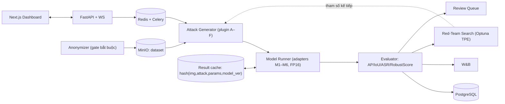

# AdverTest — Công cụ sinh & kiểm thử adversarial cho perception

**Bản kế hoạch kỹ thuật.** Mọi thành phần dưới đây đều chốt cứng: model nào, checkpoint nào, tấn công nào với tham số nào, công thức chỉ số nào, ngân sách GPU bao nhiêu.

---

## 1. Phạm vi chốt cứng

### 1.1 Dataset

| Dataset | Dùng cho | Quy mô dùng thật | Ghi chú riêng tư |
|---|---|---|---|
| **KITTI 2D Object** | Baseline chính, MVP | 7,481 ảnh train / split val 3,769 (Chen split); MVP dùng subset 500 ảnh | **Chưa ẩn danh** → bắt buộc chạy anonymizer |
| **nuScenes v1.0-mini** | Dev nhanh multi-sensor | 10 scene, 404 keyframe, 6 camera + LiDAR 32 tia | Đã blur mặt/biển số sẵn |
| **nuScenes v1.0-trainval** | Benchmark nâng cao | val split 6,019 keyframe; dùng subset phân tầng 600 | Đã blur sẵn |
| BDD100K (tuỳ chọn) | Mở rộng đa thời tiết/ban đêm | 10k val | Cần kiểm tra ẩn danh |

Chuẩn hoá nhãn: gom về 3 lớp `Car / Pedestrian / Cyclist` để so sánh chéo KITTI ↔ nuScenes.

### 1.2 Model đưa vào kiểm thử

| ID | Model | Task | Nguồn / checkpoint | Vì sao chọn |
|---|---|---|---|---|
| M1 | **YOLO11s** (hoặc YOLOv8s) | 2D detection | Ultralytics, fine-tune 30 epoch trên KITTI | Model 1-stage phổ biến nhất, chạy nhanh → làm baseline |
| M2 | **Faster R-CNN R50-FPN** | 2D detection | MMDetection `faster-rcnn_r50_fpn_1x` | So sánh 1-stage vs 2-stage |
| M3 | **RT-DETR-L** | 2D detection | Ultralytics / MMDet | So sánh CNN vs Transformer về độ bền |
| M4 | **SAM2.1-hiera-small** | Promptable segmentation | Meta SAM2 | Đo suy giảm mask IoU khi prompt = box GT |
| M5 | **PointPillars** | 3D detection (LiDAR) | MMDetection3D, nuScenes config | Trục LiDAR |
| M6 | **BEVFusion** | 3D detection (camera+LiDAR) | MMDetection3D | Kiểm tra giả thuyết "fusion bền hơn camera-only" |

MVP bắt buộc: **M1 + M4**. Nâng cao: thêm M2, M3, M5. Mở rộng: M6.

Model được nạp qua `ModelAdapter` với 4 hàm: `predict(batch)`, `loss_for_attack(batch, target)`, `postprocess()`, `metadata()`. Thêm model mới = viết 1 adapter, không sửa core.

---

## 2. Thư viện tấn công (Attack Catalog)

Mỗi phép biến đổi là một plugin khai báo: `name`, `input_modality` (image/lidar/multi), `params_schema`, `severity_levels`, `cost_class` (cheap/medium/expensive).

### Nhóm A — Common corruptions ảnh (19 loại × 5 mức = 95 biến thể)

Dùng `imagecorruptions` (chuẩn ImageNet-C, Hendrycks & Dietterich 2019 [1]; áp dụng cho detection theo Michaelis et al. [2]):

- **Noise:** gaussian_noise, shot_noise, impulse_noise, speckle_noise
- **Blur:** defocus_blur, glass_blur, motion_blur, zoom_blur, gaussian_blur
- **Weather:** snow, frost, fog, brightness, spatter
- **Digital:** contrast, elastic_transform, pixelate, jpeg_compression, saturate

`cost_class = cheap`. Đây là tầng quét đầu tiên của mọi Test Run.

### Nhóm B — Thời tiết vật lý (depth-aware)

| Phép | Mô hình | Tham số theo severity |
|---|---|---|
| Fog ảnh | Tán xạ khí quyển: `I = J·t + A(1−t)`, `t = exp(−β·d)`, `d` lấy từ LiDAR chiếu lên ảnh | β = 0.03 / 0.06 / 0.10 / 0.15 / 0.20 m⁻¹ (tầm nhìn ~100→20 m) |
| Rain ảnh | Render vệt mưa + giảm contrast + rain accumulation | 10 / 25 / 50 / 75 / 100 mm/h |
| Snow ảnh | Overlay hạt tuyết + tán xạ | 5 mức mật độ hạt |
| **Fog LiDAR** | Suy hao + back-scatter theo Hahner et al. [11] | α = 0.005 → 0.12 m⁻¹ |
| **Snow LiDAR** | Mô phỏng bông tuyết chắn tia [12] | tốc độ rơi 0.5 → 2.5 mm/h nước tương đương |

Khác biệt so với nhóm A: dùng đúng chiều sâu cảnh nên sương mù xa dày hơn gần — sát thực tế hơn overlay 2D thuần.

### Nhóm C — Che khuất & lỗi cảm biến

| Phép | Tham số |
|---|---|
| Random Erasing / CutOut | 1–3 vùng, tổng diện tích 2 / 5 / 10 / 15 / 20% ảnh |
| Occlusion theo object | Dán distractor lên box GT, tỉ lệ che r = 10 / 25 / 50 / 75% |
| Camera dropout (nuScenes) | Bỏ 1, 2, 3 trong 6 camera (đen hoặc frozen frame) |
| LiDAR beam drop | Bỏ 25 / 50 / 75% số tia |
| LiDAR sector drop | Mất góc quét 30° / 60° / 90° / 180° |
| Frame freeze | Lặp lại frame trước 1–5 keyframe (mô phỏng treo cảm biến) |

### Nhóm D — Adversarial digital (white-box)

| Attack | Chuẩn | Tham số quét | Thư viện |
|---|---|---|---|
| **FGSM** [3] | L∞ | ε ∈ {1, 2, 4, 8}/255 | torchattacks |
| **PGD** [4] | L∞ | ε ∈ {1,2,4,8}/255, α = 2.5·ε/T, T ∈ {10, 20, 40}, random start | torchattacks |
| **MI-FGSM** [5] | L∞ | μ = 1.0, T = 10 — dùng để đo transferability | torchattacks |
| **C&W** [6] | L2 | κ = 0, 100 iter, binary search c 5 bước — chỉ chạy trên subset ≤100 ảnh | torchattacks |
| **TOG** [7] | L∞ | ε = 8/255, T = 10; 3 biến thể: **vanishing / fabrication / mislabeling** | tự cài theo paper |
| **DAG** [8] | L∞ | 150 iter, tấn công dense proposal — cho M2 | tự cài |
| PGD cho SAM2 | L∞ | ε = 4/255, T = 20, maximize BCE(mask_pred, mask_GT) | custom |

Với detector, hàm mất mát tấn công dùng chính head của model: `L_attack = −(L_obj + L_cls + λ·L_box)` (untargeted), hoặc `+L_cls(target)` (targeted mislabeling).

### Nhóm E — Adversarial patch (physical-plausible)

Theo DPatch [9] và Thys et al. [10]:

- **Kích thước:** 5 / 10 / 15 / 20% diện tích box mục tiêu
- **Vị trí:** tâm box, hoặc offset ngẫu nhiên trong EOT
- **Tối ưu:** Adam, lr = 0.03, 500–1000 iteration
- **Loss:** `L = L_det + λ_tv·L_TV + λ_nps·L_NPS` (λ_tv = 2.5, λ_nps = 0.01) — TV cho patch mượt, NPS ràng buộc màu in được
- **EOT** [13]: scale 0.8–1.2, rotate ±20°, brightness ±20%, blur nhẹ — patch phải sống sót qua biến đổi mới tính là "thật"
- **Universal patch:** train trên 200 ảnh, đánh giá trên tập held-out 300 ảnh (đo khả năng tổng quát hoá)

### Nhóm F — Black-box & transfer

- **Square Attack** [14]: ε = 8/255, query budget 500 / 1000 / 2500
- **Transfer:** sinh perturbation trên M1 (YOLO) → áp lên M2, M3; báo cáo ma trận transfer 3×3

---

## 3. Chỉ số đo — công thức tường minh

Ký hiệu: `c` = loại tấn công, `s` = mức độ 1..5, `AP` = COCO mAP@[.50:.95] (thêm AP50 để dễ đọc).

| # | Chỉ số | Công thức | Ý nghĩa |
|---|---|---|---|
| 1 | `AP_clean`, `AP(c,s)` | pycocotools | Điểm gốc & điểm sau tấn công |
| 2 | **Degradation** `D(c,s)` | `(AP_clean − AP(c,s)) / AP_clean × 100%` | % suy giảm — con số chính trên UI |
| 3 | **mPC** [2] | `mean_c mean_s AP(c,s)` | AP trung bình dưới nhiễu |
| 4 | **rPC** [2] | `mPC / AP_clean × 100%` | Giữ được bao nhiêu % năng lực |
| 5 | **RR(c)** — resilience rate [15] | `mean_s AP(c,s) / AP_clean` | Bền theo từng loại nhiễu |
| 6 | **mCE** [1][15] | `mean_c [ (1−mean_s AP(c,s)) / (1−mean_s AP_base(c,s)) ]` | So với model baseline cố định |
| 7 | **Robustness Accuracy theo severity** | `RA(s) = mean_c AP(c,s) / AP_clean` | Đường cong bền vững theo mức độ — đúng yêu cầu đề bài |
| 8 | **ASR object-level** | `#{object detect đúng ở clean nhưng mất/sai sau tấn công} / #{object detect đúng ở clean}` | "Đúng ở clean" = IoU ≥ 0.5 ∧ class đúng ∧ conf ≥ 0.25 |
| 9 | **ASR image-level** | `#{ảnh có D ≥ τ} / #ảnh`, mặc định τ = 50% | Tỉ lệ ảnh bị đánh gục |
| 10 | **ASR targeted** | `#{object bị gán đúng nhãn mục tiêu} / #object` | Cho TOG-mislabeling |
| 11 | **Segmentation (M4)** | `mIoU`, `ΔmIoU`, Boundary IoU | Cho SAM2 |
| 12 | **3D (M5, M6)** | `mAP` + `NDS` (nuScenes), `AP3D@IoU 0.7/0.5` (KITTI) | Cho trục LiDAR |
| 13 | **RobustScore 0–100** | `100 × Σ_k w_k · clip( mean_{c∈k,s} AP(c,s) / AP_clean , 0, 1)` với k ∈ {thời tiết, nhiễu, che khuất, adversarial}, `w_k = 0.25` mặc định (cấu hình được) | 1 con số để so giữa các phiên bản model |
| 14 | **Vận hành** | GPU-hours/run, ảnh/giây, chi phí ước tính, cache hit rate, `N_eval` để tìm worst-case | Ràng buộc chi phí GPU của đề bài |

**Độ tin cậy:** mọi AP báo cáo kèm khoảng tin cậy 95% bằng bootstrap 1000 lần trên tập ảnh. Không so sánh 2 model nếu CI chồng nhau.

**Sanity check bắt buộc chạy trong CI** (theo checklist Carlini et al. [16] — nếu bỏ, số liệu robustness dễ sai):

1. `ε = 0` → `AP == AP_clean` (sai lệch < 0.1 điểm)
2. `AP(c,s)` giảm đơn điệu theo `s` và theo `ε` — vi phạm ⇒ nghi cài sai hoặc gradient masking
3. PGD phải mạnh hơn FGSM ở cùng `ε`
4. Baseline nhiễu ngẫu nhiên cùng norm `ε` phải yếu hơn PGD; nếu không ⇒ attack không hội tụ
5. Tăng `T` của PGD không được làm AP tăng

---

## 4. Kiến trúc

Stack: Python 3.11 / PyTorch 2.x / FastAPI / Next.js + Recharts / PostgreSQL / Redis + Celery / MinIO / W&B / Docker + NVIDIA Container Toolkit.

**Luồng 1 Test Run:** chọn dataset (đã ẩn danh) + model + nhóm tấn công → ước tính GPU & xác nhận → sinh biến thể → inference batch → tính chỉ số → ghi DB + W&B → run nào có `RobustScore < ngưỡng` tự tạo case trong Review Queue → Reviewer ra quyết định (ghi audit log).

---

## 5. Tối ưu chi phí GPU

| Kỹ thuật | Cách làm | Lợi ích kỳ vọng |
|---|---|---|
| Cache prediction sạch | Chạy 1 lần/(model, dataset), tái dùng cho mọi so sánh | −50% forward pass |
| Content-addressed cache | Key = `hash(image_id, attack, params, model_version)`; trùng thì không chạy lại | Tuỳ mức lặp cấu hình |
| Corruption trên GPU | Chuyển từ `imagecorruptions` (CPU, ~100–300 ms/ảnh, là nút cổ chai thật sự) sang kornia/CUDA cho các phép sinh được | 3–10× throughput tầng quét |
| FP16 + `torch.compile` + batch tuning | Runner tự dò batch size lớn nhất vừa VRAM | 1.5–2× |
| **Quét 2 tầng** | Tầng 1: toàn bộ nhóm A trên subset phân tầng n = 300 (theo scene/ngày-đêm/mật độ object). Tầng 2: chỉ chạy attack đắt (PGD-40, C&W, patch) trên top-k cấu hình nguy hiểm nhất | Cắt phần lớn compute vô ích |
| Dừng sớm theo thống kê | Ngừng thêm ảnh khi CI 95% của rPC hẹp hơn 2 điểm AP | −30–60% ảnh phải chạy |
| **Auto Red-Team Search** | Optuna TPE (hoặc BoTorch qEI) trên không gian `(loại attack, ε, severity, kích thước & vị trí patch)`, mục tiêu `min AP`; ngân sách **60 trial** thay vì grid ~2,000 tổ hợp | Mục tiêu ≥ 5× giảm GPU-hours để chạm cùng mức worst-case |

KPI phải báo cáo: `GPU-hours(grid) / GPU-hours(BO)` khi cùng tìm ra cấu hình có `AP` thấp tương đương (chênh ≤ 1 điểm AP).

---

## 6. Ẩn danh dữ liệu (cổng bắt buộc)

- **Phát hiện:** face detector SCRFD/RetinaFace (insightface) + biển số bằng YOLOv8 fine-tune trên dữ liệu biển số công khai.
- **Ngưỡng:** đặt thiên về recall cao (~0.98); giảm false positive bằng cách chỉ giữ box giao với box GT `person`/`car` — đúng cách nuScenes làm [17].
- **Xử lý:** Gaussian blur với σ tỉ lệ cạnh box (hoặc mosaic), lưu manifest + hash.
- **Ràng buộc hệ thống:** dataset chưa có manifest ẩn danh bị khoá ở bước tạo Test Run, không có đường bypass.
- **Lưu ý số liệu:** nuScenes đã blur sẵn khi phát hành; KITTI thì chưa. Vì blur *cũng làm thay đổi ảnh*, tool phải đo và báo cáo riêng `ΔAP` do ẩn danh trên baseline, để không lẫn với suy giảm do tấn công.

---

## 7. Human-in-the-loop & vai trò

| Vai trò | Quyền |
|---|---|
| **Engineer** | Tạo dataset, chạy Test Run, xem so sánh trước/sau, gắn cờ case |
| **Reviewer** | Xem Robustness Report, xử lý hàng đợi, ra quyết định cuối, ký duyệt |
| Admin (tuỳ chọn) | Người dùng, model registry, ngân sách GPU, ngưỡng gate |

Quyết định của Reviewer là enum bắt buộc: `Chấp nhận rủi ro` / `Yêu cầu retrain` / `Cần thêm dữ liệu` / `Từ chối`, kèm ghi chú bắt buộc, ghi vào audit log không sửa được. Hệ thống **không** có API nào đẩy model sang môi trường triển khai; mọi màn hình gắn banner `SIMULATION ONLY — chưa validate`.

---

## 8. Giao diện (6 màn, đủ dùng)

1. **Datasets** — upload, import KITTI/nuScenes, nút Anonymize kèm preview trước/sau, trạng thái khoá/mở.
2. **New Test Run** — chọn model + dataset, chọn nhóm tấn công A–F với slider severity, bật/tắt Red-Team Search, đặt trần GPU; **hiển thị ước tính thời gian & chi phí trước khi bấm Run**.
3. **Job Monitor** — % tiến độ, log WebSocket, GPU utilization, nút Cancel.
4. **Comparison Viewer** — slider trước/sau, box/mask overlay màu (xanh = đúng, đỏ = mất/sai, vàng = tụt confidence), panel IoU & confidence từng object, nút "Gắn cờ Review".
5. **Robustness Report** — heatmap (hàng = loại tấn công, cột = severity, ô = `D(c,s)`), đường cong `RA(s)`, bảng ASR, RobustScore, so sánh nhiều model; export PDF/CSV; click ô → nhảy tới ảnh cụ thể.
6. **Review Queue** — danh sách case, form quyết định, audit log.

---

## 9. Lộ trình & Definition of Done

### Sprint 1 — Cơ bản (bám đúng mục "Cơ bản" của đề bài)
**Xong khi:** áp được nhóm A (19×5) + PGD + 1 loại patch lên KITTI-500, chạy M1 và M4, hiển thị so sánh trước/sau, xuất bảng `AP_clean / AP(c,s) / D(c,s)` và mask IoU, có đủ 2 vai trò Engineer + Reviewer, anonymizer chạy được, 5 sanity check pass.

### Sprint 2 — Nâng cao
**Xong khi:** quét tự động toàn bộ A–E theo severity, heatmap + `RA(s)` + ASR + RobustScore tự sinh, Worst-Case Top-N, benchmark ≥3 model đồng bộ W&B, cache + quét 2 tầng + dừng sớm hoạt động, báo cáo được GPU-hours tiết kiệm.

### Sprint 3 — Đột phá (tuỳ thời gian)
Auto Red-Team Search (Optuna) với KPI ≥5× tiết kiệm; Grad-CAM + phân cụm failure theo pattern; CI/CD Robustness Gate chặn merge khi `RobustScore` giảm quá ngưỡng; mở rộng M5/M6 và nhóm B LiDAR.

### Nếu là hackathon 24–48h
Làm trọn Sprint 1 + heatmap của Sprint 2 + bản rút gọn Red-Team (Optuna 30 trial trên 1 model, 100 ảnh). Pre-run sẵn kết quả trên tập lớn để demo phần benchmark, tránh chạy live.

---

## 10. Đối chiếu đề bài

| Yêu cầu | Đáp ứng ở mục |
|---|---|
| Sinh nhiễu / corruption thời tiết / che khuất / patch | §2 nhóm A, B, C, E |
| Tấn công adversarial | §2 nhóm D, E, F |
| Đo mAP/IoU trước–sau | §3 chỉ số 1, 2, 11, 12 |
| Robustness accuracy theo mức độ nhiễu | §3 chỉ số 7 (`RA(s)`) |
| Tỷ lệ tấn công thành công | §3 chỉ số 8, 9, 10 |
| ≥2 vai trò | §7 |
| Human-in-the-loop | §7, màn hình 6 |
| Chỉ simulation, chưa validate không triển khai | §7 (banner + không có API tới production) |
| Tối ưu chi phí GPU | §5 |
| Ẩn danh mặt/biển số | §6 |
| Quét nhiều loại theo mức độ, tự lập bảng robustness | §9 Sprint 2 (heatmap) |
| Tìm biến thể làm model fail nhiều nhất | §5 Auto Red-Team + Worst-Case Top-N |
| Benchmark định lượng | §3 + W&B |

---

## 11. Rủi ro kỹ thuật

| Rủi ro | Xử lý |
|---|---|
| **Gradient masking** → tưởng model bền nhưng thực ra attack yếu | 5 sanity check ở §3, luôn kèm baseline nhiễu ngẫu nhiên cùng norm, thêm Square Attack (không cần gradient) [14][18] |
| Kết luận từ subset quá nhỏ | Bootstrap CI 95%, cấm so sánh khi CI chồng nhau |
| Patch "thắng" chỉ vì đúng 1 tư thế | Bắt buộc EOT khi train patch [13]; báo cáo riêng kết quả patch universal trên tập held-out |
| Ẩn danh làm giảm AP, bị hiểu nhầm là do attack | Đo và báo cáo `ΔAP` do ẩn danh riêng (§6) |
| Chi phí GPU vượt trần | Ước tính bắt buộc trước khi chạy + hard cap + hủy job |
| Reviewer quá tải | Gom cụm failure theo pattern, chỉ đẩy đại diện cụm lên hàng đợi |

---

## 12. Tài liệu tham khảo

**Corruption & benchmark robustness**

1. Hendrycks & Dietterich. *Benchmarking Neural Network Robustness to Common Corruptions and Perturbations*. ICLR 2019. arXiv:1903.12261 — nguồn gốc bộ 15 corruption × 5 severity và chỉ số CE/mCE.
2. Michaelis et al. *Benchmarking Robustness in Object Detection: Autonomous Driving when Winter is Coming*. NeurIPS 2019 ML4AD Workshop. arXiv:1907.07484 — định nghĩa **mPC** và **rPC**, bộ Pascal-C/COCO-C/Cityscapes-C.
15. Kong et al. *Robo3D: Towards Robust and Reliable 3D Perception against Corruptions*. ICCV 2023. arXiv:2303.17597 — 8 loại corruption × 3 mức cho LiDAR, chỉ số **mCE** và **mRR**.
19. Dong et al. *Benchmarking Robustness of 3D Object Detection to Common Corruptions in Autonomous Driving*. CVPR 2023. arXiv:2303.11040 — 27 loại corruption cho LiDAR + camera, bộ KITTI-C / nuScenes-C / Waymo-C.

**Tấn công adversarial**

3. Goodfellow et al. *Explaining and Harnessing Adversarial Examples*. ICLR 2015. arXiv:1412.6572 — FGSM.
4. Madry et al. *Towards Deep Learning Models Resistant to Adversarial Attacks*. ICLR 2018. arXiv:1706.06083 — PGD.
5. Dong et al. *Boosting Adversarial Attacks with Momentum*. CVPR 2018. arXiv:1710.06081 — MI-FGSM, transferability.
6. Carlini & Wagner. *Towards Evaluating the Robustness of Neural Networks*. IEEE S&P 2017. arXiv:1608.04644 — C&W.
7. Chow et al. *TOG: Targeted Adversarial Objectness Gradient Attacks on Real-time Object Detection Systems*. arXiv:2004.04320 — object-vanishing / fabrication / mislabeling.
8. Xie et al. *Adversarial Examples for Semantic Segmentation and Object Detection*. ICCV 2017. arXiv:1703.08603 — DAG.
9. Liu et al. *DPatch: An Adversarial Patch Attack on Object Detectors*. arXiv:1806.02299.
10. Thys, Van Ranst & Goedemé. *Fooling Automated Surveillance Cameras: Adversarial Patches to Attack Person Detection*. CVPRW 2019. arXiv:1904.08653 — loss TV + NPS.
13. Athalye et al. *Synthesizing Robust Adversarial Examples*. ICML 2018. arXiv:1707.07397 — EOT.
14. Andriushchenko et al. *Square Attack: a query-efficient black-box adversarial attack via random search*. ECCV 2020. arXiv:1912.00049.
20. Brown et al. *Adversarial Patch*. NIPS 2017 Workshop. arXiv:1712.09665.
21. Eykholt et al. *Robust Physical-World Attacks on Deep Learning Visual Classification*. CVPR 2018. arXiv:1707.08945 — RP2, sticker trên biển báo.

**Phương pháp luận đánh giá**

16. Carlini et al. *On Evaluating Adversarial Robustness*. arXiv:1902.06705 — checklist tránh kết luận sai; nền tảng cho §3 sanity check.
18. Athalye, Carlini & Wagner. *Obfuscated Gradients Give a False Sense of Security*. ICML 2018. arXiv:1802.00420 — gradient masking.
22. Croce & Hein. *Reliable Evaluation of Adversarial Robustness with an Ensemble of Diverse Parameter-free Attacks (AutoAttack)*. ICML 2020. arXiv:2003.01128.

**Mô phỏng thời tiết & dữ liệu**

11. Hahner et al. *Fog Simulation on Real LiDAR Point Clouds for 3D Object Detection*. ICCV 2021. arXiv:2108.05249.
12. Hahner et al. *LiDAR Snowfall Simulation for Robust 3D Object Detection*. CVPR 2022. arXiv:2203.15118.
17. Caesar et al. *nuScenes: A Multimodal Dataset for Autonomous Driving*. CVPR 2020. arXiv:1903.11027 — quy trình blur mặt/biển số dựa trên detector recall cao + lọc theo box GT.
23. Sakaridis, Dai & Van Gool. *Semantic Foggy Scene Understanding with Synthetic Data*. IJCV 2018. arXiv:1708.07819 — Foggy Cityscapes, mô hình tán xạ dùng ở §2 nhóm B.
24. Geiger, Lenz & Urtasun. *Are we ready for Autonomous Driving? The KITTI Vision Benchmark Suite*. CVPR 2012.

**Công cụ**

25. Kim. *Torchattacks: A PyTorch Repository for Adversarial Attacks*. arXiv:2010.01950.
26. Ravi et al. *SAM 2: Segment Anything in Images and Videos*. arXiv:2408.00714.
27. Chen et al. *MMDetection: Open MMLab Detection Toolbox and Benchmark*. arXiv:1906.07155 (và MMDetection3D).
28. Akiba et al. *Optuna: A Next-generation Hyperparameter Optimization Framework*. KDD 2019. arXiv:1907.10902 — TPE dùng cho Auto Red-Team Search.
