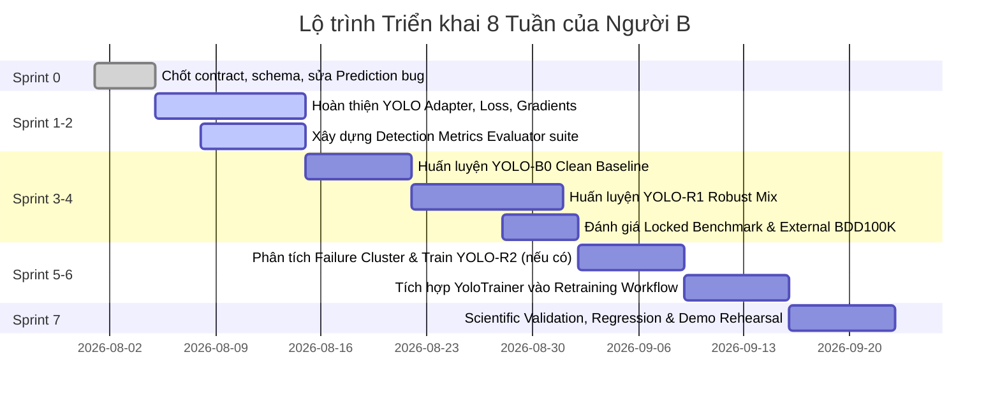

# CẨM NANG HƯỚNG DẪN DÀNH RIÊNG CHO NGƯỜI B
## Chuyên trách: YOLO11, 2D Object Detection & Robustness Retraining

> **Tài liệu tham chiếu chuẩn:** Căn cứ theo kế hoạch hợp nhất `Ke-hoach-hop-nhat-cuc-ky-chi-tiet-AdverTest.md`.  
> **Người thực hiện:** Người B (Detection & Model Robustness Engineer).  
> **Mục tiêu cốt lõi:** Xây dựng, hoàn thiện, huấn luyện và đánh giá toàn bộ luồng phát hiện vật thể 2D (YOLO11s), từ baseline sạch (B0) đến robust mix (R1) và targeted repair (R2), cung cấp hệ thống đo lường chất lượng phát hiện chuẩn xác và phục vụ hiển thị trên WebApp.

---

## MỤC LỤC
1. [Vai trò, Trách nhiệm và Ranh giới của Người B](#1-vai-trò-trách-nhiệm-và-ranh-giới-của-người-b)
2. [Quy tắc Dữ liệu, Phân loại Class và Chống Data Leakage](#2-quy-tắc-dữ-liệu-phân-loại-class-và-chống-data-leakage)
3. [Kiến trúc Kỹ thuật và Các Module Mã Nguồn Phụ trách](#3-kiến-trúc-kỹ-thuật-và-các-module-mã-nguồn-phụ-trách)
4. [Đặc tả YOLO11 Adapter (`src/adapters/yolo11.py`)](#4-đặc-tả-yolo11-adapter-srcadaptersyolo11py)
5. [Hệ thống Metric và Đánh giá Detection (`src/evaluation/detection_metrics.py`)](#5-hệ-thống-metric-và-đánh-giá-detection-srcevaluationdetection_metricspy)
6. [Kiến trúc Huấn luyện và Huấn luyện viên YOLO (`src/training/yolo_trainer.py`)](#6-kiến-trúc-huấn-luyện-và-huấn-luyện-viên-yolo-srctrainingyolo_trainerpy)
7. [Quy trình Huấn luyện 3 Cấp độ Model: YOLO-B0, YOLO-R1, YOLO-R2](#7-quy-trình-huấn-luyện-3-cấp-độ-model-yolo-b0-yolo-r1-yolo-r2)
8. [Tiêu chuẩn Tuyển chọn Checkpoint (Checkpoint Acceptance Gates)](#8-tiêu-chuẩn-tuyển-chọn-checkpoint-checkpoint-acceptance-gates)
9. [Hợp đồng Bàn giao cho Người A (Web) và Người D (Data/Benchmark)](#9-hợp-đồng-bàn-giao-cho-người-a-web-và-người-d-databenchmark)
10. [Lộ trình Triển khai 8 Tuần của Người B](#10-lộ-trình-triển-khai-8-tuần-của-người-b)
11. [Chiến lược Kiểm thử và Tiêu chuẩn Nghiệm thu (Definition of Done)](#11-chiến-lược-kiểm-thử-và-tiêu-chuẩn-nghiệm-thu-definition-of-done)
12. [Sổ tay Lệnh Vận hành và Thực thi (CLI Runbook)](#12-sổ-tay-lệnh-vận-hành-và-thực-thi-cli-runbook)

---

## 1. Vai trò, Trách nhiệm và Ranh giới của Người B

### 1.1 Vai trò chính
Người B sở hữu toàn bộ luồng nghiệp vụ 2D Object Detection:
```text
Detection Dataset (KITTI / BDD100K)
  └── YOLO11 Adapter (Inference, Loss, Gradient)
       └── YOLO-B0 (Clean Baseline Training)
            └── YOLO Attack Evaluation (Single & Composite Scenarios)
                 └── YOLO-R1 (Robust Mix Fine-tuning)
                      └── YOLO-R2 (Targeted Cluster Repair khi cần)
                           └── Detection Evaluator (AP50, AP75, mAP, ASR, Failure Reasons)
                                └── External Generalization Test (BDD100K)
                                     └── Model Checkpoints, Lineage & Recovery Report Input
```

Người B chịu trách nhiệm cuối cùng về:
- Tính đúng đắn của dự đoán bounding box (`xyxy`), nhãn lớp (`Car`, `Pedestrian`, `Cyclist`), độ tin cậy (`confidence`) và độ trễ (`latency_ms`).
- Khả năng tính gradient và loss vi phân phục vụ các thuật toán tấn công (FGSM, PGD, Patch).
- Hệ thống huấn luyện `YoloTrainer` tuân thủ lifecycle của hệ thống.
- Chất lượng khoa học của mô hình: Đạt gate robust hóa mà không làm suy giảm nghiêm trọng độ chính xác trên ảnh sạch (clean performance).

### 1.2 Ranh giới phân công (Ai làm gì?)
| Thành phần | Người phụ trách | Vai trò của Người B |
|---|---|---|
| **WebApp, Giao diện, REST API, WebSocket, Database** | Người A | Bàn giao schema `DetectionPrediction`, dữ liệu mẫu, quy ước overlay |
| **YOLO11 Adapter, Detection Metrics, YOLO Trainer, Checkpoint** | **Người B** | **Chịu trách nhiệm toàn quyền và duy nhất** |
| **SAM2 Adapter, Segmentation Metrics, SAM Trainer** | Người C | Không phụ trách (trao đổi chuẩn chung nếu cần) |
| **Data Engine, Attack Engine, Benchmark Runner, RobustScore chung** | Người D | Phối hợp nhận dataset split, cung cấp metric detection để D tính RobustScore |

---

## 2. Quy tắc Dữ liệu, Phân loại Class và Chống Data Leakage

### 2.1 Tập dữ liệu sử dụng
1. **In-domain Dataset (Chính):** KITTI Object Detection (hoặc dataset nội bộ đã ẩn danh hóa).
   - Chuẩn hóa cố định về 3 lớp đối tượng:
     - `Car` (bao gồm xe con, xe tải/xe bus nếu kích hoạt alias).
     - `Pedestrian` (người đi bộ).
     - `Cyclist` (người đi xe đạp / xe máy).
2. **External Dataset (Kiểm định tổng quát hóa):** BDD100K Detection subset.
   - **Quy tắc mapping class bắt buộc:**
     - BDD100K `car` $\rightarrow$ `Car`
     - BDD100K `person` / `pedestrian` $\rightarrow$ `Pedestrian`
     - BDD100K `bicycle` / `motorcycle` / `rider` $\rightarrow$ `Cyclist`
   - Tuyệt đối không dùng external dataset để chọn checkpoint trong quá trình huấn luyện.

### 2.2 Quy tắc phân chia Split và Chống Leakage
| Split | Tỷ lệ | Mục đích sử dụng |
|---|---:|---|
| **Train Split** | 70% | Dùng huấn luyện YOLO-B0 và sinh dữ liệu phòng thủ (defense variants) cho R1/R2 |
| **Validation Split** | 15% | Dùng chọn checkpoint tốt nhất và early stopping |
| **Locked Test Split** | 15% | Đóng băng hoàn toàn; chỉ dùng benchmark độc lập cuối cùng |

> **QUY TẮC CHỐNG LEAKAGE BẤT DI BẤT DỊCH:**  
> - Tuyệt đối không đưa ảnh từ `Locked Test Split` vào tập huấn luyện hoặc tập sinh defense data.  
> - Khi phát hiện điểm yếu từ benchmark (ví dụ: *Pedestrian nhỏ ở xa + Fog* bị miss), Người B phải phối hợp lọc các mẫu *Pedestrian nhỏ* **từ Train Split**, sinh biến thể sương mù bằng seed mới để fine-tune.

### 2.3 Tiêu chuẩn Preprocessing & Augmentation
- **Kích thước đầu vào tham chiếu:** $640 \times 640$ pixel.
- **Letterbox padding:** Giữ nguyên tỉ lệ khung hình (aspect ratio), pad màu xám trung tính (114, 114, 114).
- **Pixel normalization:** Scale $[0, 255] \rightarrow [0.0, 1.0]$.
- **Standard Augmentation cho Baseline B0:** Resize, Horizontal Flip ($p=0.5$), Scale jitter ($0.8 - 1.2$), Color jitter nhẹ (HSV-Shift), Mosaic có kiểm soát.

---

## 3. Kiến trúc Kỹ thuật và Các Module Mã Nguồn Phụ trách

Người B trực tiếp phát triển và làm chủ các module sau trong codebase:

```text
src/
├── adapters/
│   └── yolo11.py               <-- Model Adapter: Inference, Gradients, Differentiable Loss
├── evaluation/
│   └── detection_metrics.py    <-- Evaluator: mAP50-95, Per-Class, Size Buckets, ASR, Failure Reasons
├── training/
│   ├── yolo_trainer.py         <-- ModelTrainer implementation: Train B0, R1, R2, Gate Checks
│   └── registry.py             <-- Đăng ký "yolo11" vào TrainerRegistry
└── cli.py                      <-- CLI commands phục vụ huấn luyện và đánh giá YOLO
```

---

## 4. Đặc tả YOLO11 Adapter (`src/adapters/yolo11.py`)

### 4.1 Yêu cầu kỹ thuật
`Yolo11Adapter` kế thừa từ `src.adapters.base.ModelAdapter` và phải đáp ứng:
1. **Khởi tạo linh hoạt:** Hỗ trợ load bất kỳ checkpoint `.pt` nào (pretrained gốc, B0, R1, R2).
2. **Inference chuẩn xác:** 
   - Đầu ra trả về danh sách `DetectionPrediction(sample_id=..., boxes=..., latency_ms=...)`.
   - Bounding box chuẩn định dạng `Box(x1, y1, x2, y2, label, score)`.
   - Đo lường chính xác `latency_ms` trên mỗi sample.
3. **Keyword-only constructor cho Prediction:** Tránh lỗi positional parameter làm sai lệch trường dữ liệu.
4. **Hỗ trợ Gradient & Loss cho Adversarial Attacks:**
   - Cung cấp phương thức `input_gradient(sample, target)` trả về gradient ảnh định dạng tensor/ndarray để FGSM, PGD, Patch tấn công trực tiếp.
   - Cung cấp `loss_for_attack(sample, target)` với các mục tiêu: `detection_loss`, `objectness`, `class_logits`, `class_margin`.
5. **Metadata & Lineage:** Trả về `ModelInfo` bao gồm tên model, task (`detection2d`), hash của checkpoint và version preprocessing.

---

## 5. Hệ thống Metric và Đánh giá Detection (`src/evaluation/detection_metrics.py`)

### 5.1 Bộ 5 Metric cốt lõi hiển thị trực tiếp (Five Key Metrics)
1. **Clean Detection Score ($mAP@[.50:.95]$):** Điểm số trên tập ảnh sạch chuẩn.
2. **Score After Attack ($mAP@[.50:.95]$):** Điểm số sau khi áp dụng kịch bản tấn công.
3. **Performance Lost (Degradation %):**
   $$\text{Degradation} = \frac{\text{Clean mAP} - \text{Attacked mAP}}{\text{Clean mAP}} \times 100\%$$
4. **Objects Broken by Attack (Object-level ASR %):**
   $$\text{Object ASR} = \frac{\text{Số object nhận diện đúng trên clean nhưng bị hỏng trên attacked}}{\text{Tổng số object nhận diện đúng trên clean}} \times 100\%$$
5. **Recovery Rate (% - khi so sánh B0 và R1/R2):**
   $$\text{Recovery} = \frac{\text{Defended Attacked mAP} - \text{Baseline Attacked mAP}}{\text{Baseline Clean mAP} - \text{Baseline Attacked mAP}} \times 100\%$$

### 5.2 Bộ Metric chi tiết & Phân tích chuyên sâu (Advanced Metrics)
- **Độ phân giải IoU:** AP50 (IoU 0.50), AP75 (IoU 0.75), Recall, Precision, F1-Score.
- **Phân rã theo Lớp (Per-class AP):** AP riêng cho `Car`, `Pedestrian`, `Cyclist`.
- **Phân rã theo Kích thước Đối tượng (Object Size Breakdown):**
  - Small: Diện tích box $< 32^2 = 1024 \text{ px}^2$.
  - Medium: $32^2 \le \text{Diện tích} < 96^2 = 9216 \text{ px}^2$.
  - Large: Diện tích box $\ge 96^2 = 9216 \text{ px}^2$.
- **Độ tin cậy & Lệch biên:** Độ sụt giảm trung bình confidence, phân phối IoU giữa box dự đoán và GT.
- **Khoảng tin cậy Bootstrap 95%:** Cho phép kết luận khoa học có ý nghĩa thống kê.

### 5.3 Phân loại Lý do Thất bại trên từng Object (Failure Categorization)
Mỗi ground-truth object khi so sánh giữa Clean và Attacked phải được phân loại trạng thái:
- `correct`: Phát hiện đúng cả trước và sau attack.
- `missed`: Bị bỏ sót hoàn toàn sau attack (không có box nào trùng IoU $\ge 0.5$).
- `misclassified`: Tìm thấy vị trí box nhưng sai nhãn lớp (ví dụ: `Pedestrian` thành `Car`).
- `confidence_collapsed`: Vẫn match vị trí nhưng confidence tụt xuống dưới ngưỡng phát hiện ($< 0.25$).
- `localization_degraded`: Bị lệch box khiến IoU tụt xuống dưới ngưỡng chấp nhận.
- `false_positive`: Xuất hiện box ảo trên nền nhiễu/vùng không có vật thể.

---

## 6. Kiến trúc Huấn luyện và Huấn luyện viên YOLO (`src/training/yolo_trainer.py`)

### 6.1 Cấu trúc class `YoloTrainer`
`YoloTrainer` kế thừa từ `src.training.base.ModelTrainer` và thực thi đầy đủ 6 phương thức trừu tượng:

```python
class YoloTrainer(ModelTrainer):
    def validate_config(self, config: TrainingRunConfig) -> ValidationReport:
        """Kiểm tra tính hợp lệ của hyperparameters, split_id, seed, storage budget."""
        ...

    def estimate(self, config: TrainingRunConfig) -> TrainingEstimate:
        """Ước tính GPU-hours, dung lượng lưu trữ (storage bytes) và thời gian thực thi."""
        ...

    def prepare_data(self, config: TrainingRunConfig) -> PreparedTrainingData:
        """Tải manifest huấn luyện, kiểm tra anti-leakage và chuẩn bị data loader."""
        ...

    def train(self, config: TrainingRunConfig, callbacks: TrainerCallbacks) -> TrainingReport:
        """Thực thi vòng lặp huấn luyện, emit event từng epoch, kiểm tra early stopping."""
        ...

    def evaluate_checkpoint(self, checkpoint: CheckpointMetadata) -> MetricSnapshot:
        """Chạy đánh giá validation clean và robust trên checkpoint."""
        ...

    def export_checkpoint(self, checkpoint: CheckpointMetadata) -> ExportedCheckpoint:
        """Kiểm tra khả năng load lại độc lập và đóng gói artifact mô hình."""
        ...

    def metadata(self) -> TrainerMetadata:
        """Trả về metadata nhận diện: name='yolo11', task='detection2d', version='...'."""
        ...
```

---

## 7. Quy trình Huấn luyện 3 Cấp độ Model: YOLO-B0, YOLO-R1, YOLO-R2

```text
Pretrained YOLO11s (Ultralytics)
  │
  ▼ [Sprint 3]
YOLO-B0 (Clean Baseline)
  ├── Dữ liệu: 100% Training Split Clean + Standard Augmentations
  ├── Thời lượng: ~30 epochs, AMP, AdamW/SGD
  └── Tiêu chí: Chọn checkpoint có Validation Clean mAP cao nhất
        │
        ▼ [Sprint 3-4]
YOLO-R1 (Robust Mix)
  ├── Dữ liệu phối trộn:
  │     ├── 40% Clean Replay
  │     ├── 30% Weather / Common Corruption (Fog, Rain, Noise, Blur - Sev 1-3)
  │     ├── 15% Occlusion (Random Erasing, CutOut, Partial Box Occlusion)
  │     ├── 10% Fast Adversarial (FGSM / PGD 2-3 bước)
  │     └── 5%  Cached Patch Attack
  ├── Khởi tạo: Fine-tune từ YOLO-B0 (15–25 epochs), freeze backbone 3-5 epochs đầu nếu cần
  └── Tiêu chí: Vượt qua Gate Tuyển chọn Checkpoint Robust
        │
        ▼ [Sprint 5-6] (Chỉ thực hiện nếu R1 còn cụm lỗi nghiêm trọng)
YOLO-R2 (Targeted Repair)
  ├── Dữ liệu phối trộn:
  │     ├── 60% General Robust Replay
  │     ├── 25% Target Failure Analogues (Mẫu tương tự từ Train split với seed mới)
  │     └── 15% Clean Class-Balanced Replay
  └── Mục tiêu: Khắc phục dứt điểm cụm lỗi nguy hiểm mà không hồi quy clean accuracy
```

---

## 8. Tiêu chuẩn Tuyển chọn Checkpoint (Checkpoint Acceptance Gates)

Một checkpoint của **YOLO-R1** hoặc **YOLO-R2** chỉ được nghiệm thu và đăng ký chính thức khi thỏa mãn **đồng thời** tất cả các điều kiện:

1. **Bảo toàn Clean AP:** Clean mAP giảm **không quá 2.0 điểm** (hoặc $\le 2.0\%$) so với Baseline YOLO-B0.
2. **Tăng cường Robustness:** `RobustScore` tăng **ít nhất 8.0 điểm** HOẶC Mean Attacked mAP tăng rõ rệt ($> 15\%$ tương đối).
3. **Không phá vỡ Critical Scenarios:** Không có kịch bản hiểm nghèo nào bị tụt quá 3.0 điểm mAP so với trước khi sửa.
4. **Không bùng nổ ASR:** Tỷ lệ ASR ở các kịch bản an toàn trọng yếu không tăng quá 5 điểm phần trăm.
5. **Tổng quát hóa ngoại miền (External Generalization):** mAP trên BDD100K external test không bị suy giảm quá 3.0 điểm.
6. **Được kiểm định trên cùng Locked Benchmark:** Đảm bảo so sánh Paired-sample với cùng seed và metric implementation.

---

## 9. Hợp đồng Bàn giao cho Người A (Web) và Người D (Data/Benchmark)

### 9.1 Bàn giao cho Người A (Web Developer)
1. **Schema Dự đoán (`DetectionPrediction`):**
   ```python
   {
       "sample_id": "kitti_000123",
       "boxes": [
           {"x1": 102.5, "y1": 180.2, "x2": 240.0, "y2": 320.5, "label": "Car", "score": 0.89},
           {"x1": 450.0, "y1": 195.0, "x2": 490.5, "y2": 310.0, "label": "Pedestrian", "score": 0.76}
       ],
       "latency_ms": 14.8,
       "metadata": {"model_version": "yolo11s-robust-r1"}
   }
   ```
2. **Schema Dữ liệu Đối chiếu Object (Per-object Evaluation Detail):**
   - Danh sách chi tiết từng vật thể: GT box, Clean prediction, Attacked prediction, IoU, trạng thái (`correct`, `missed`, `misclassified`, `confidence_collapsed`, ...).
3. **Quy ước Bounding Box Overlay:**
   - Màu xanh lá: True Positive (Phát hiện đúng).
   - Màu đỏ: False Negative / Missed (Bỏ sót).
   - Màu vàng/cam: False Positive / Misclassified (Báo ảo hoặc sai nhãn).

### 9.2 Bàn giao cho Người D (Data & Benchmark Lead)
1. **`Yolo11Adapter` callable:** Khả năng nhận batch `Sample` và trả về `list[DetectionPrediction]`.
2. **Objective Loss & Gradient API:** Để Người D tích hợp vào Runner chạy tấn công PGD / FGSM / Patch.
3. **Hàm đánh giá detection độc lập (`detection_metric_suite`):** Trả về dict các giá trị mAP50, mAP75, mAP50-95, AP per-class, AP per-size để D tổng hợp vào `RobustScore` và `RecoveryReport`.
4. **Checkpoint artifacts:** File `.pt` kèm mã băm SHA-256 và file metadata cấu hình huấn luyện.

---

## 10. Lộ trình Triển khai 8 Tuần của Người B



- **Sprint 0 (Ngày 1-4):** Chốt contract `DetectionPrediction`, chuẩn hóa keyword-only args, sửa unit `degradation_pct`.
- **Sprint 1-2 (Tuần 1-2):** Hoàn thiện `Yolo11Adapter` với gradient/loss vi phân; Xây dựng bộ `detection_metrics.py` (AP50-95, Per-Class, Size Buckets, ASR, Failure Reasons).
- **Sprint 3-4 (Tuần 3-4):** Chạy huấn luyện YOLO-B0; huấn luyện YOLO-R1 với robust mix; chạy đánh giá trên locked benchmark và BDD100K; nghiệm thu gate robust.
- **Sprint 5-6 (Tuần 5-6):** Xây dựng `YoloTrainer` hoàn chỉnh; thực hiện sửa lỗi đích danh YOLO-R2 nếu có cụm lỗi; kết nối pipeline retraining.
- **Sprint 7 (Tuần 7-8):** Kiểm định khoa học toàn diện, kiểm tra tính tất định với seed, diễn tập demo.

---

## 11. Chiến lược Kiểm thử và Tiêu chuẩn Nghiệm thu (Definition of Done)

### 11.1 Bộ kiểm thử bắt buộc của Người B
1. **Unit Tests Adapter (`tests/test_adapters/test_yolo11.py`):**
   - Kiểm tra load checkpoint, schema dự đoán, keyword-only args, đo độ trễ, mapping nhãn lớp COCO/BDD100K.
   - Kiểm tra tính toán gradient đầu vào (`input_gradient`) không rỗng và đúng kích thước.
   - Kiểm tra giá trị loss vi phân cho attack.
2. **Unit Tests Metrics (`tests/test_evaluation/test_detection_metrics.py`):**
   - Kiểm tra IoU, Greedy Matcher theo score, mAP 10 ngưỡng IoU.
   - Kiểm tra tính chính xác của AP theo từng class và từng size bucket.
   - Kiểm tra Object-level ASR và hàm phân loại lý do thất bại.
3. **Unit Tests Trainer (`tests/test_training/test_yolo_trainer.py`):**
   - Kiểm tra cấu hình `YoloTrainer`, ước lượng GPU-hours, chuẩn bị dữ liệu, mock training loop, checkpoint gate verification, xuất model.
4. **Scientific Validation Tests (`tests/test_yolo_scientific_validation.py`):**
   - Kiểm tra tính đơn điệu (monotonicity) khi tăng severity.
   - Kiểm tra không rò rỉ dữ liệu giữa locked test và train split.
   - Kiểm tra trade-off giữa clean performance và robust performance.
   - Kiểm tra tính tái lập tuyệt đối khi cố định random seed.

### 11.2 Definition of Done (DoD) cho Người B
Người B được xác nhận hoàn thành nhiệm vụ khi:
- [x] `Yolo11Adapter` chạy hoàn hảo với đầy đủ tính năng inference, gradient và loss vi phân.
- [x] Đã huấn luyện và đăng ký thành công checkpoint `YOLO-B0` (Clean Baseline).
- [x] Đã huấn luyện và đăng ký thành công checkpoint `YOLO-R1` (Robust Mix) thỏa mãn Acceptance Gate.
- [x] Bộ công cụ `detection_metrics.py` tính toán đầy đủ mAP50-95, class/size breakdown, ASR và lý do lỗi.
- [x] Có kết quả đánh giá trên Locked Benchmark và External Dataset (BDD100K).
- [x] Cung cấp đầy đủ payload và dữ liệu mẫu cho Người A hiển thị lên WebApp.
- [x] Toàn bộ test suite liên quan đến Detection đạt 100% Passed.

---

## 12. Sổ tay Lệnh Vận hành và Thực thi (CLI Runbook)

### 12.1 Chạy toàn bộ Test Suite của Người B
```bash
pytest tests/test_adapters/test_yolo11.py tests/test_evaluation/test_detection_metrics.py tests/test_training/test_yolo_trainer.py -v
```

### 12.2 Chạy Đánh giá Detection trên dữ liệu mẫu
```bash
python -m src.cli evaluate-detection --weights models/yolo11s_clean.pt --dataset data/kitti/val --iou 0.5
```

### 12.3 Khởi chạy Huấn luyện YOLO-B0 Clean Baseline
```bash
python -m src.cli train-yolo --mode baseline --epochs 30 --batch 8 --lr 0.001 --output runs/train/yolo_b0
```

### 12.4 Khởi chạy Huấn luyện YOLO-R1 Robust Mix
```bash
python -m src.cli train-yolo --mode robust-mix --base-weights runs/train/yolo_b0/best.pt --epochs 20 --batch 8 --output runs/train/yolo_r1
```

---
*Tài liệu này là quy chuẩn thực hiện chính thức của Người B trong dự án AdverTest.*
