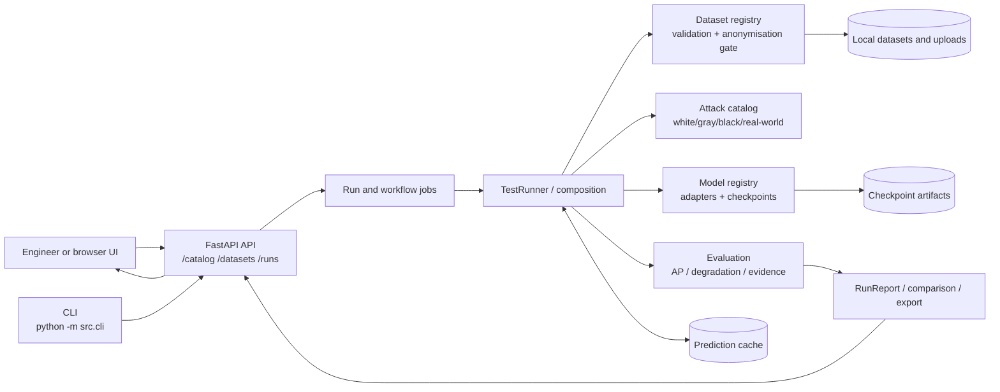
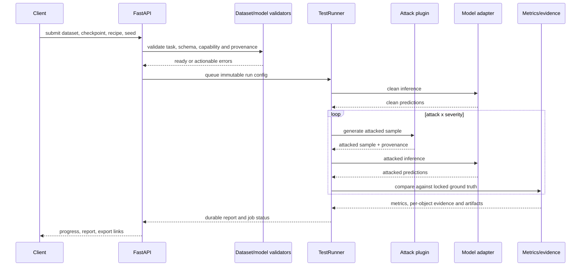

# AdverTest architecture diagrams

These diagrams describe the repository's component boundaries and data flow for
a benchmark run. The platform is simulation-only: results are evidence for
human review, not a deployment-safety claim.

## Component architecture

## Data flow

## Boundary rules

- `Perception Mode`, model family, checkpoint and dataset contract remain separate.
- A base checkpoint is used by Attack; fine-tuned/repaired checkpoints belong to Defence.
- Missing ground truth permits quick inference only; it cannot produce benchmark AP/mAP.
- The backend preflight is the final compatibility gate even when the UI disables an option.

## Operational contracts

| Boundary | Input | Output | Failure is reported as |
|---|---|---|---|
| Ingestion -> validation | image/sensor files, task, annotations | validated dataset version | field-level validation issues |
| Catalog -> preflight | family, checkpoint, recipe, capabilities | compatible run plan | incompatible task/capability/annotation |
| Runner -> adapter | canonical sample and locked preprocessing | predictions and provenance | adapter/runtime error |
| Evaluation -> report | clean/attacked predictions and ground truth | metrics, evidence, artifacts | incomplete benchmark evidence |

All long-running boundaries expose a durable job state so the UI can reconnect,
show progress, cancel work when supported, and retain the reason for failure.

## Extension points

New attacks, model adapters, datasets, and metrics are registered behind their
existing contracts. The API and UI consume catalog metadata rather than
hard-coding implementation details, so compatibility remains a backend
decision even when a client is upgraded independently.
